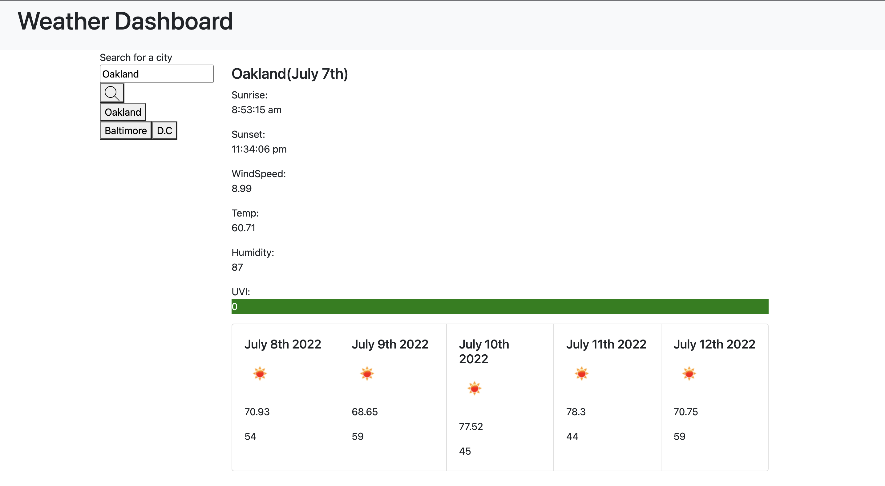

# Weather Dashboard

This is a weather dashboard created for users to check the temperature, humidity, wind speed, UVI, sunrise, & sunset of any city within the U.S. It features dynamic HTML and CSS. I've used localStorage to store persistent data. 

# Technologies

- HTML
- CSS
- JavaScript
- OpenWeather API to retrieve weather data
- localStorage to store persistent data


# Deployed Link and URL

- https://priyarizal.github.io/weather-app/
- https://github.com/priyarizal/weather-app

# Significant Code Snippets

LocalStorage

````
    const userAction = async (inputValue) => {
        const response = await fetch(`http://api.openweathermap.org/geo/1.0/direct?q=${inputValue},,US&appid=${weather.apiKey}`)
        const myJson = await response.json(); //extract JSON from the http response
        // do something with myJson
        console.log(myJson)


````

# Screen Shots for Design Highlight



# Gif for Demoing Functionality


# Contributors

- UCB bootcamp instructor : Jerome Channete

- Divesh Rizal

# Contact Me

- www.linkedin.com/in/priya-r-822271110
- https://github.com/priyarizal

# License

- MIT
